# RustChef - Technical Report

## Overview

RustChef is a command-line tool inspired by [CyberChef](https://gchq.github.io/CyberChef/), the "Cyber Swiss Army Knife". It provides 16 data transformation, encoding, decoding, hashing, extraction, and analysis operations from the terminal. The tool is written in Rust and follows a modular architecture with a clean CLI interface.

## Architecture

RustChef follows a single-binary, modular architecture:

```
src/
|-- main.rs              Entry point: CLI parsing, input reading, operation dispatch
|-- cli.rs               Clap derive definitions for all 16 subcommands
|-- ops/
    |-- mod.rs           Module declarations
    |-- base64_op.rs     Base64 encode / decode
    |-- hex_op.rs        Hex encode / decode
    |-- url_op.rs        URL percent encode / decode
    |-- hash_op.rs       MD5, SHA1, SHA256 hashing
    |-- rot13_op.rs      ROT13 letter substitution
    |-- xor_op.rs        XOR with repeating byte key
    |-- extract_op.rs    IP, URL, email regex extraction
    |-- stats_op.rs      Text statistics (char, word, line, byte, counts)
    |-- entropy_op.rs    Shannon entropy (bits/byte)
```

### Control Flow

1. `main.rs` parses CLI arguments via `clap` (derive API)
2. Depending on the subcommand, `main.rs` calls the appropriate `ops::*` function
3. Input is read either from a positional argument or from stdin (if no argument is given)
4. Each operation returns a `Result<String>`; errors are propagated via `anyhow`
5. Output is printed to stdout via `println!`

### Design Decisions

| Decision | Rationale |
|----------|-----------|
| **Single subcommand per invocation** | Follows Unix philosophy of composability; chaining via `\|` |
| **Positional argument or stdin** | Enables both direct use and pipe-based use |
| **Binary output as hex fallback** | When decode/XOR output is not valid UTF-8, hex representation is shown |
| **anyhow for errors** | Simple, ergonomic error propagation with clear user messages |
| **Clap derive API** | Type-safe, concise, auto-generated `--help` |
| **No streaming** | Simpler implementation; acceptable for a CLI tool processing typical inputs |

## Implemented Operations

| # | Subcommand | Category | Description |
|---|-----------|----------|-------------|
| 1 | `base64-encode` | Encoding | Encode bytes to Base64 (RFC 4648) |
| 2 | `base64-decode` | Encoding | Decode Base64 to bytes |
| 3 | `hex-encode` | Encoding | Encode bytes to lowercase hex string |
| 4 | `hex-decode` | Encoding | Decode hex string to bytes |
| 5 | `url-encode` | Encoding | Percent-encode a string (RFC 3986) |
| 6 | `url-decode` | Encoding | Percent-decode a string |
| 7 | `rot13` | Transformation | Apply ROT13 cipher (a->n, b->o, etc.) |
| 8 | `xor` | Transformation | XOR bytes with a repeating key |
| 9 | `md5` | Hashing | Compute MD5 digest (128-bit, hex) |
| 10 | `sha1` | Hashing | Compute SHA1 digest (160-bit, hex) |
| 11 | `sha256` | Hashing | Compute SHA256 digest (256-bit, hex) |
| 12 | `extract-ips` | Extraction | Extract IPv4 addresses (dotted decimal) and IPv6 addresses |
| 13 | `extract-urls` | Extraction | Extract HTTP/HTTPS/FTP URLs |
| 14 | `extract-emails` | Extraction | Extract email addresses |
| 15 | `stats` | Analysis | Count characters, words, lines, bytes, letters, digits, whitespace, punctuation |
| 16 | `entropy` | Analysis | Compute Shannon entropy in bits per byte |

## Dependencies

| Crate | Version | Purpose |
|-------|---------|---------|
| `clap` | 4 | CLI argument parsing with derive API |
| `base64` | 0.22 | Base64 encoding/decoding (general purpose) |
| `percent-encoding` | 2 | URL percent encoding/decoding |
| `sha2` | 0.10 | SHA256 cryptographic hash |
| `sha1` | 0.10 | SHA1 cryptographic hash |
| `md-5` | 0.10 | MD5 cryptographic hash |
| `regex` | 1 | Regex-based IP, URL, email extraction |
| `anyhow` | 1 | Simple error handling and context |

## Testing Strategy

### Test Suite (30 integration tests)

All tests are in `tests/integration.rs` and invoke the compiled binary via `env!("CARGO_BIN_EXE_rustchef")`.

**Coverage categories:**

| Category | Tests | Examples |
|----------|-------|---------|
| Known-answer correctness | 12 | `base64-encode "hello" -> "aGVsbG8="`, `md5 "hello" -> "5d41402abc4b2a76b9719d911017c592"` |
| Roundtrip fidelity | 6 | encode -> decode returns original for Base64, hex, URL, ROT13, XOR |
| Error handling | 5 | invalid Base64, invalid hex, odd-length hex, empty XOR key, invalid URL encoding |
| Stdin input | 1 | pipe input to `base64-encode` |
| Edge cases | 3 | empty input for stats, ROT13 on numbers, entropy of uniform data |
| Extraction | 3 | IP addresses (including invalid ones), URLs, emails |

### Running Tests

```bash
cargo test              # all 30 integration tests
cargo clippy            # zero warnings
```

## Evidence of Execution

### 1. Help message

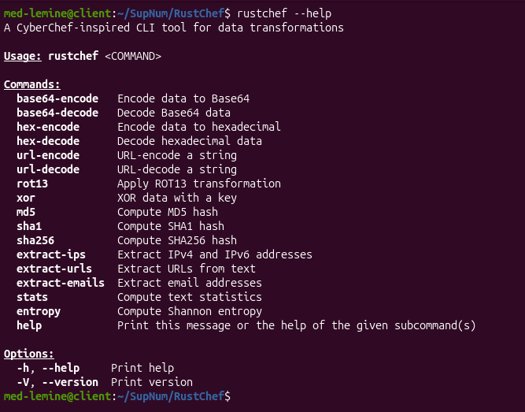

### 2. All 30 tests passing

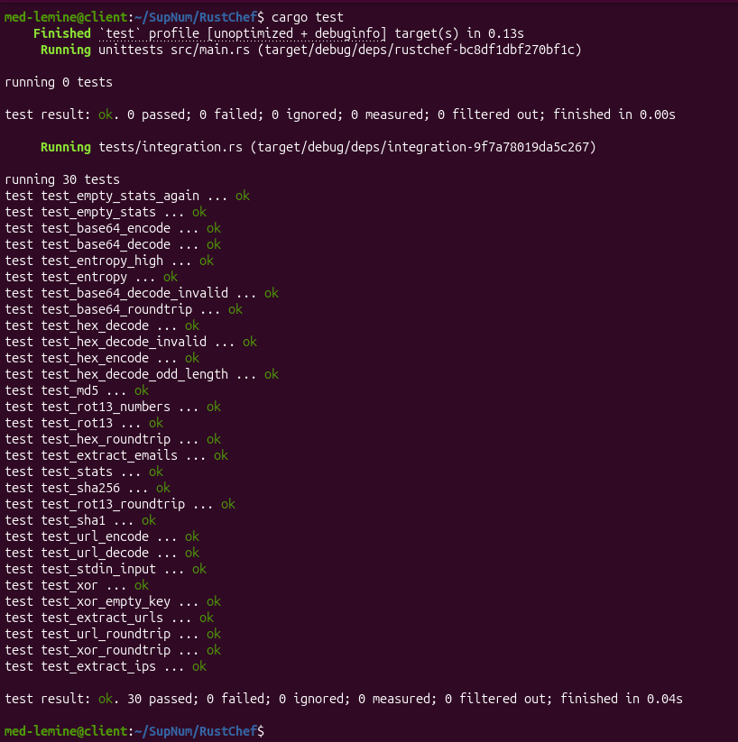

### 3. Clippy with zero warnings


### 4. Encoding / Decoding (Base64, Hex, URL, ROT13)

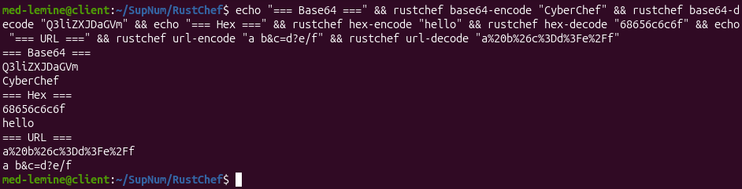

### 5. Hashing (MD5, SHA1, SHA256)

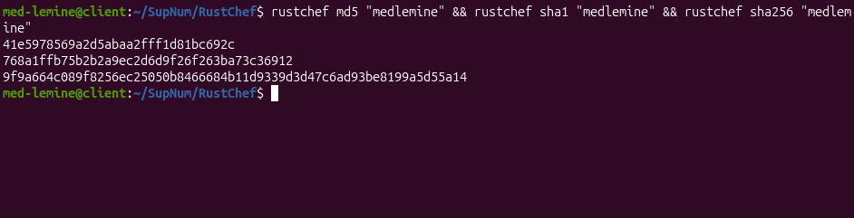

### 6. ROT13 and XOR

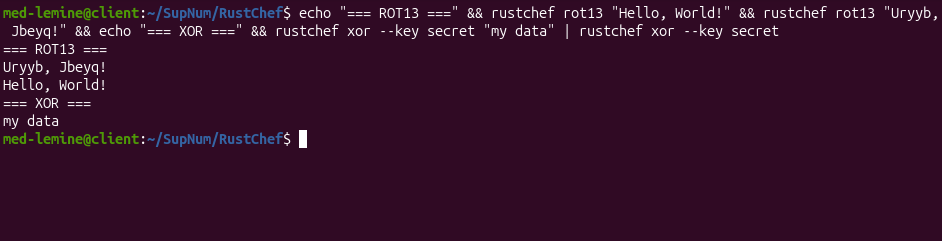

### 7. Extraction (IPs, URLs, Emails)

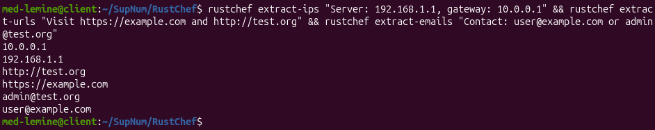

### 8. Analysis (Stats, Entropy)

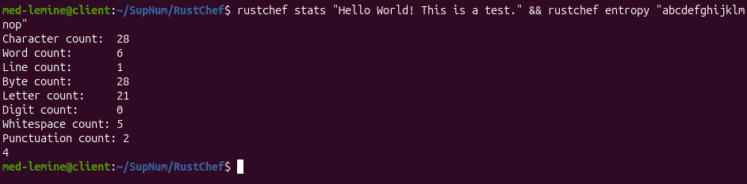

### 9. Piped stdin input

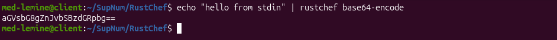

### 10. Docker run

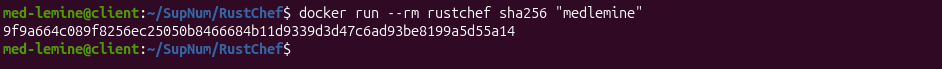

### 11. Docker build

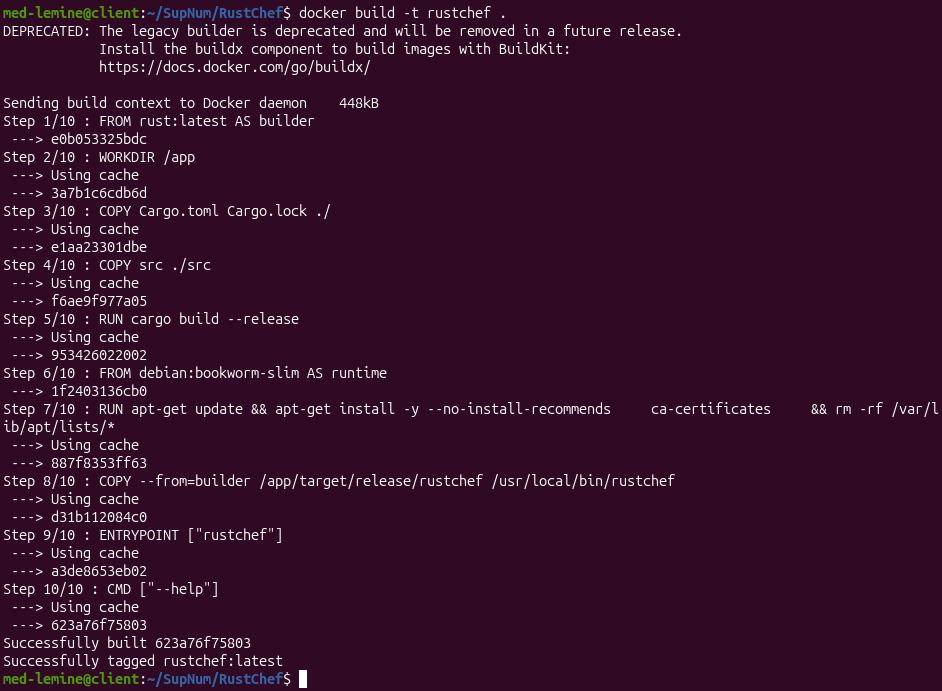

### 12. Sample file processing

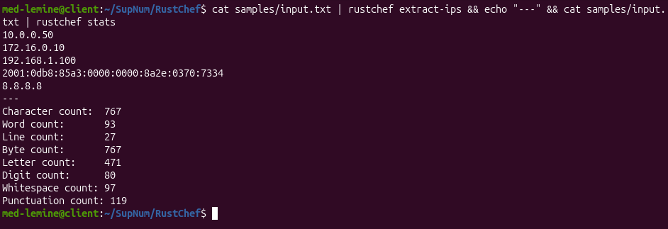

## Limitations

1. **No recipe chaining**: Unlike CyberChef, operations cannot be chained within a single invocation. Users must pipe commands or use intermediate files.
2. **Binary output as hex**: Non-UTF-8 binary output is displayed as a hex string rather than raw bytes, limiting use in binary pipelines.
3. **Extraction regexes**: Regex-based extraction may miss edge cases (IPv6 compressed notation, unusual URL schemes, internationalized email addresses).
4. **In-memory processing**: The tool reads the entire input into memory, which may be problematic for very large files (>1GB).
5. **Single Rust edition**: Requires Rust edition 2021; not compatible with older toolchains.

## Deliverables

| Item | Location |
|------|----------|
| GitHub repository | [https://github.com/MedElMostapha/RustChef](https://github.com/MedElMostapha/RustChef) |
| Rust source code | `src/` |
| Cargo manifest | `Cargo.toml`, `Cargo.lock` |
| Integration tests | `tests/integration.rs` |
| Dockerfile | `Dockerfile` |
| README | `README.md` |
| Technical report | `docs/report.md` |
| Sample input | `samples/input.txt` |
| Expected outputs | `samples/expected/` |
